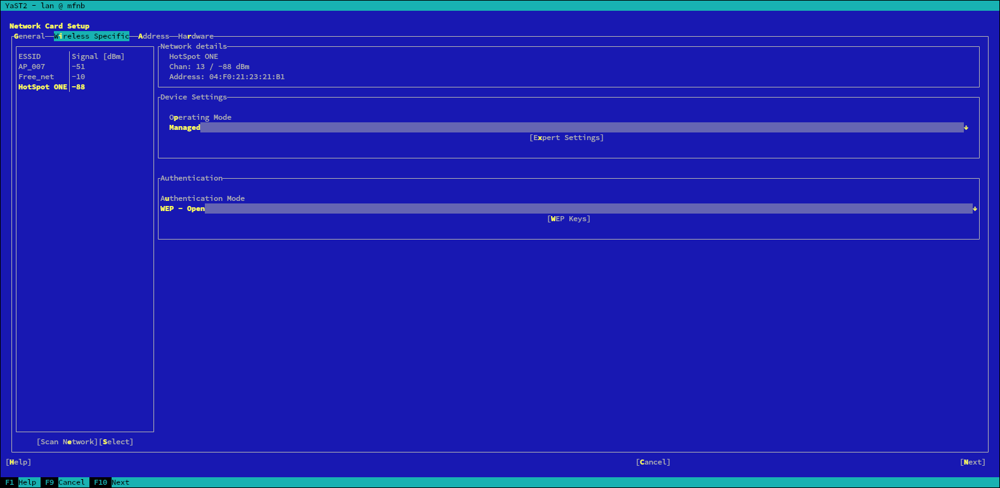
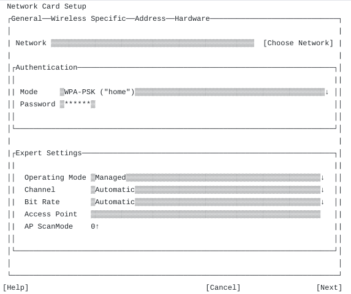

## New Wi-Fi tab - summary

Shortened version of discussion here [Long description](./new-wifi-tab.md)

After some discussions, we have come to two possible looks and two possible workflows how to handle Wi-Fi configuration in the new Wi-Fi tab. In my POV, one workflow is more suitable for the first look, second one for the second look. See summary in the following table.

What | Modification one                                                               | Modification two
-----|--------------------------------------------------------------------------------|-----------------
Look |     | 
     | * Number of details can be added into the overview. Depends on upcoming        | * Basically old initial view and expert view merged into one
     |   discussion                                                                   |   together with some layout fine tuning
Flow | * List of available ESSIDs is populated automatically (e.g. at 1st tab switch) | * Combobox with ESSIDs is populated on request
     | * Manual scan button still possible                                            |

Together with the above proposals, I propose to implement "Select" button as can be seen on the left screenshot. Purpose of this button is to explicitly select wireless network to connect to. It is change against the original state when wireless network is selected by selecting an ESSID, clicking Next and then closing the yast lan module with OK. The old approach can lead to unexpected change of wireless network easily - e.g. when checking for network details.
