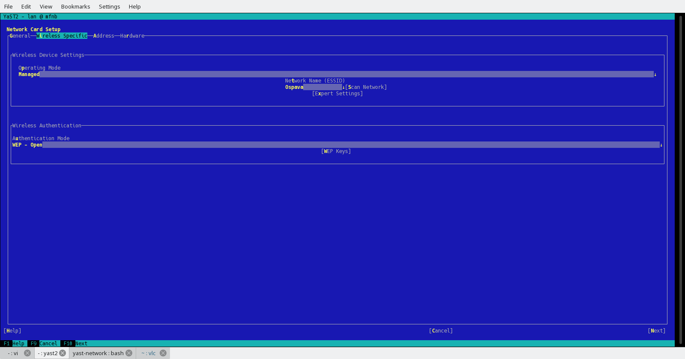

## Original state

What we started with is

## Minimal improvement

* First try for improving the look and feel of the wifi tab, was to re-arrange existing widgets to make new layout more transparent.
* Main change was to replace a combobox which currently stores list of ESSID by a table. Motivation was to have list of available wifi networks better visible.
* Rest of widgets should be filled according to which ESSID is selected

## More improvements

* Here was motivation to use opportunity and improve the view a bit more
* Changes would be related to adding more details into network overview, like e.g. signal strength, to putting more details into Scan results - not only populate a list of available ESSIDs but also displaying some more details to make the choice easier for the user

* Another changes would be related to a workflow how yast parses wifi networks information

### Changes in workflow - Approach 1

* When wlan device is available in the system, yast performs network scan as a part of lan module startup.
* Pros:
	- list of networks (ESSIDs) would be available immediately once user switches to the WiFi tab. Scan network button could be used only when looking for changes
	- details of network would be loaded when particular network is selected
* Contras:
	- influences module startup time even when user doesn't want to touch wifi configuraion at all

### Changes in workflow - Approach 2

* WiFi network scan is postponed to the time when user switches to the WiFi Tab

* The network scan can be done automatically when (first time) switching to the WiFi Tab or (only) by explicitly clicking at Scan network button

* Pros:
	- no impact on startup time
	- close to the current behaviour

* Contras:
	- list of available networks / ESSIDs is not available when switching to the tab but the one which is potentialy currently in use
