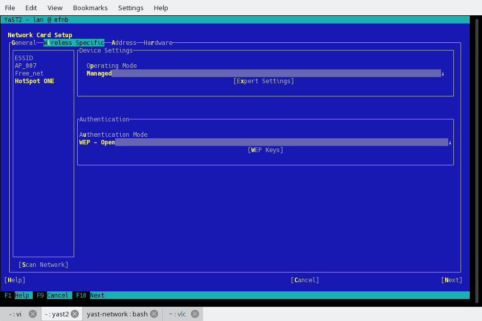

## Original state

What we started with is

## Minimal improvement

* First try for improving the look and feel of the wifi tab, was to re-arrange existing widgets to make new layout more transparent.
* Main change was to replace a combobox which currently stores list of ESSID by a table. Motivation was to have list of available wifi networks better visible.
* Rest of widgets should be filled according to which ESSID is selected

